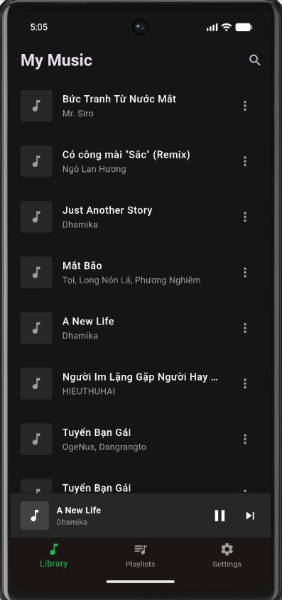
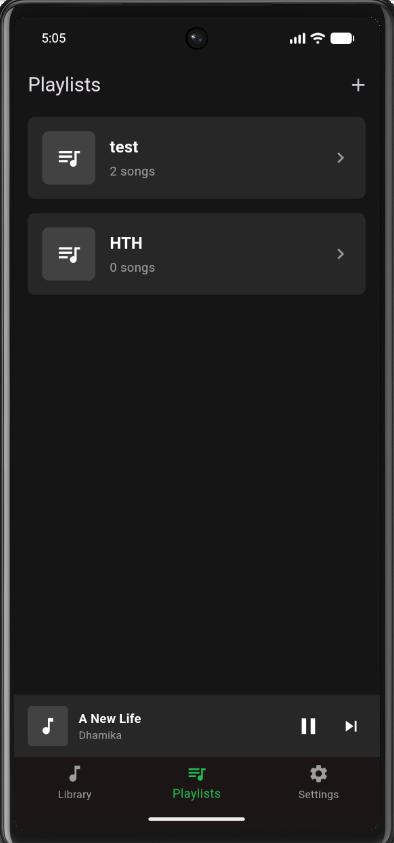
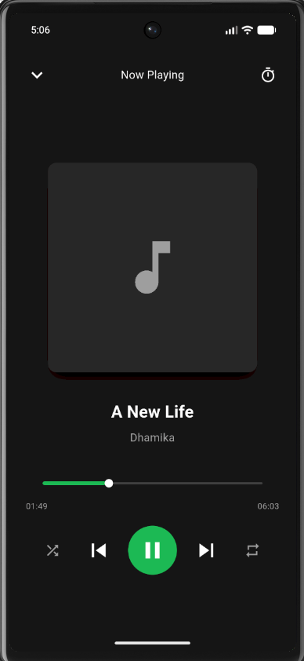
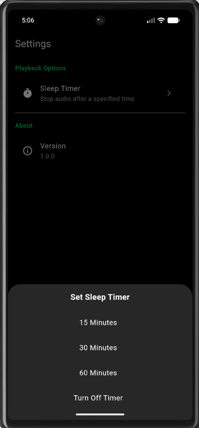

# 🎵 Trình Phát Nhạc Offline (Offline Music Player)

Một ứng dụng phát nhạc offline hiện đại, đầy đủ tính năng và có giao diện tuyệt đẹp được xây dựng bằng Flutter. Ứng dụng này cho phép người dùng phát nhạc, quản lý và tổ chức các file âm thanh có sẵn trên bộ nhớ thiết bị một cách mượt mà.

link demo: https://drive.google.com/file/d/1uOjBuIMk_H5wqqls0P2sfQiqJEY_lmBU/view?usp=drive_link

## 1. Mô tả dự án và Tính năng (Project description and features)

**Offline Music Player** được thiết kế tập trung mạnh vào trải nghiệm UI/UX, sử dụng kiến trúc phân lớp (layered architecture) giúp dễ dàng bảo trì mã nguồn. Ứng dụng bao gồm bộ xử lý âm thanh nâng cao, quản lý trạng thái dữ liệu tĩnh và thiết kế tương tác đổi màu theo bài hát.

**Các tính năng nổi bật:**
- **Tích hợp Âm thanh (Audio Integration):** Tính năng Phát (Play), Tạm dừng (Pause), Dừng (Stop) và Tua (Seek) mượt mà.
- **Quản lý File (File Management):** Tự động quét và lấy danh sách file âm thanh (`.mp3`, `.m4a`, v.v.) trực tiếp từ bộ nhớ thiết bị.
- **Thiết kế UI/UX:** Giao diện bắt mắt với hiệu ứng nền đổi màu động (trích xuất từ ảnh bìa bài hát), thiết kế gọn gàng và có thanh mini-player dùng chung trên toàn app.
- **Quản lý Trạng thái (State Management):** Xử lý đồng bộ trạng thái phát nhạc, danh sách phát và tiến trình bài hát cực kỳ tối ưu thông qua `Provider`.
- **Quản lý Playlist:** Tạo mới, chỉnh sửa, quản lý playlist tùy chỉnh. Thêm hoặc xóa bài hát dễ dàng.
- **Điều khiển Nhạc (Audio Controls):** Tích hợp đủ Trộn bài (Shuffle), Lặp lại (Repeat One/All/Off), Bài trước, Bài sau và Thanh kéo thời gian.
- **Hiển thị Siêu dữ liệu (Metadata):** Đọc và hiển thị đầy đủ thông tin Tên bài, Ca sĩ, Album và Ảnh bìa (Artwork) đính kèm trong file nhạc.
- **Phát nhạc dưới nền (Background Playback):** Nhạc vẫn tiếp tục chạy khi ẩn ứng dụng, kèm theo thanh điều khiển nhạc trên màn hình khóa và thanh thông báo.
- **Lưu trữ dữ liệu (Persistence):** Ghi nhớ các cài đặt của người dùng như Danh sách phát (Playlist), trạng thái Shuffle/Repeat, Volume và tự động tải sẵn bài hát đang nghe dở ở lần mở app trước bằng `SharedPreferences`.
- **Hẹn giờ Tắt (Sleep Timer):** Đặt thời gian để tự động dừng nhạc kèm theo hiệu ứng âm thanh giảm dần (fade-out) tinh tế.

## 2. Hướng dẫn Cài đặt (Setup instructions)

Để biên dịch và chạy dự án này trên máy của bạn, hãy đảm bảo bạn đã cài đặt Flutter SDK.

1. **Clone mã nguồn về máy:** 
   ```bash
   git clone https://github.com/VanAn6504/music_player.git
   cd music_player
   ```
2. **Cài đặt các gói thư viện (Dependencies):**
   ```bash
   flutter pub get
   ```
3. **Chạy Ứng dụng:**
   ```bash
   flutter run
   ```

## 3. Ảnh chụp màn hình 

Màn hình All Songs   



Màn hình Playlist   



Màn hình Now Playing 



Màn hình Setting



## 4. Hướng dẫn thêm nhạc để Test 

Ứng dụng quét trực tiếp bộ nhớ vật lý của thiết bị (MediaStore). Để test, bạn cần chép file âm thanh vào thiết bị Android hoặc máy ảo.

**Trên máy ảo (Android Emulator):**
1. Tải một vài file `.mp3` hoặc `.m4a` về máy tính của bạn.
2. **Kéo và thả (Drag and Drop)** các file đó trực tiếp vào cửa sổ màn hình máy ảo đang mở. *(File sẽ tự động được lưu vào thư mục `Downloads` của máy ảo).*
3. **Kích hoạt quét Media:** Mở ứng dụng `Files` (Tệp) hoặc `Google Files` có sẵn trong máy ảo, tìm đến mục `Downloads` và bấm Play một bài hát để bắt hệ điều hành Android ghi nhận file đó.
4. **Khởi động lại App:** Quay lại app Music Player, nhấn phím `R` trên terminal để Hot Restart, các bài hát sẽ hiện lên.

**Trên thiết bị thật (Physical Device):**
- Kết nối điện thoại với máy tính qua cổng USB, chép các file `.mp3` vào thư mục `Music` hoặc `Download` trong bộ nhớ trong của điện thoại.

## 5. Công nghệ sử dụng 

- **Framework:** Flutter / Dart
- **State Management (Quản lý trạng thái):** `provider`
- **Audio Playback (Phát nhạc):** `just_audio`, `just_audio_background`
- **Audio Metadata Query (Đọc thẻ nhạc):** `on_audio_query`
- **Audio Session Handling:** `audio_session`
- **Persistence Storage (Lưu trữ dữ liệu):** `shared_preferences`
- **Permissions (Cấp quyền):** `permission_handler`
- **UI Utilities:** `palette_generator` (tạo màu động), `marquee` (chữ chạy ngang)

## 6. Nguồn bản quyền nhạc 

có thể tải nhạc từ những trang web tải nhạc miễn phí như:

- https://www.nhaccuatui.com/
- https://zingmp3.vn/
- https://bandcamp.com/

## 7. Các hạn chế hiện tại 

- **Hỗ trợ iOS:** Ứng dụng hiện tại được tối ưu hóa sâu nhất cho Android. Để chạy mượt mà mọi tính năng trên iOS (đặc biệt là chạy ngầm), cần cấu hình thêm thông số trong `Info.plist`.
- **Thư viện khổng lồ:** Thời gian quét lần đầu tiên có thể hơi chậm nếu người dùng có một thư viện nhạc cực kỳ lớn (trên 10,000 bài hát).
- **Tìm kiếm:** Tính năng tìm kiếm trên giao diện đang được hiển thị "Coming Soon" và chưa được xử lý thuật toán lọc.

## 8. Hướng phát triển trong tương lai 

- **Global Search:** Hoàn thiện giao diện tìm kiếm để tìm nhanh tên bài hát, tên nghệ sĩ hoặc album.
- **Equalizer (Bộ chỉnh âm):** Bổ sung tính năng điều chỉnh tần số âm thanh (Bass/Treble) để tùy biến hồ sơ âm thanh.
- **Yêu thích (Favorites):** Thêm nút "Bắn tim" để thao tác nhanh đưa bài hát vào playlist "Yêu thích".
- **Sắp xếp (Sorting):** Cho phép người dùng sắp xếp thư viện theo Ngày thêm, Thứ tự bảng chữ cái, hoặc Nghệ sĩ.
- **Hỗ trợ Lời bài hát (Lyrics):** Hiển thị lời bài hát đồng bộ thời gian (LRC) hoặc lời bài hát tĩnh (từ thẻ ID3).
